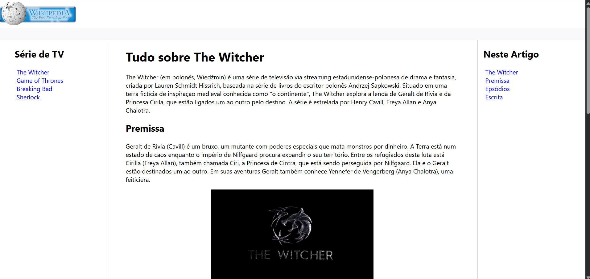

# 📚 Clone do Site da Wikipedia em HTML

Projeto desenvolvido com **HTML5**, inspirado no layout e estrutura da **Wikipedia**, onde foram criadas páginas individuais para séries de TV que gosto, todas interligadas por uma **página principal de navegação**.

O projeto tem foco em **estruturação semântica**, **organização de conteúdo** e **navegação entre múltiplas páginas HTML**, simulando um pequeno site informativo.

---

## 🌐 Deploy do Projeto

🔗 Acesse o projeto online:  
https://develyshow.github.io/Clone_site_Wiki_em_HTML/index.html

---

## 📸 Preview do Projeto



---

## 🚀 Funcionalidades

- Página principal com links para cada série
- Uma página HTML dedicada para cada série
- Navegação interna entre páginas
- Estrutura inspirada no layout da Wikipedia
- Conteúdo organizado em seções
- Uso de HTML semântico
- Projeto leve e funcional

---

## 🎯 Objetivo do Projeto

Este projeto foi desenvolvido com o objetivo de praticar:

- Estruturação de sites apenas com **HTML**
- Criação de múltiplas páginas interligadas
- Organização de conteúdo informativo
- Uso correto de tags semânticas
- Simulação de um site real baseado em referência visual
- Boas práticas de navegação entre páginas

---

## 🛠️ Tecnologias Utilizadas

- **HTML5**
- **Git & GitHub**
- **GitHub Pages** (Deploy)

---

## 📂 Estrutura do Projeto

```bash
.
├── assets/
│   └── images/
│       └── Screen.png
├── series/
│   ├── serie1.html
│   ├── serie2.html
│   └── serie3.html
├── index.html
└── README.md
